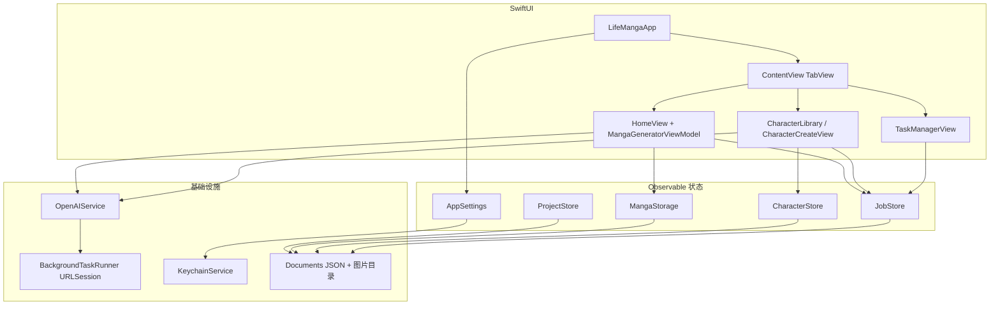

# LifeManga 代码结构与架构

本文档描述仓库当前的 **代码结构** 与 **软件架构**（原生 **SwiftUI + iOS**，通过 OpenAI API 做漫画/角色图生成，本地持久化）。

---

## 1. 仓库与目录结构

```
LifeManga/                          # 仓库根
├── README.md
├── LICENSE
├── .gitignore
└── LifeManga/
    ├── LifeManga.xcodeproj/      # Xcode 工程
    └── LifeManga/                  # 主 Target 源码与资源
        ├── LifeMangaApp.swift      # @main 入口
        ├── Models/
        │   ├── AppSettings.swift   # 全局设置（含 API Key 等）
        │   ├── MangaItem.swift     # 工程、单页、剧本、角色、任务日志条目等模型
        │   └── MangaStyle.swift    # 漫画风格枚举与预览组件
        ├── ViewModels/
        │   └── MangaGeneratorViewModel.swift  # 单页生成状态机
        ├── Views/
        │   ├── ContentView.swift   # 根 Tab + 工程列表/角色库/任务/发布等大量界面（文件体量很大）
        │   ├── HomeView.swift      # 工程内「创作」页
        │   ├── HistoryView.swift   # 工程内「历史」
        │   ├── SettingsView.swift
        │   ├── MangaDetailView.swift
        │   └── ImagePickerView.swift
        ├── Services/
        │   ├── OpenAIService.swift # OpenAI 调用、后台 URLSession、本地通知
        │   ├── MangaStorage.swift  # ProjectStore / CharacterStore / JobStore / MangaStorage
        │   └── KeychainService.swift
        ├── Assets.xcassets
        └── Preview Content/
```

**说明：** Xcode 的「分组」（`Models` / `Views` / `Services`）与磁盘路径基本一致；但 **`ContentView.swift` 集中放了工程 Tab、角色库 Tab、任务中心、多段导航与辅助视图**，因此「视图」不止 `Views/` 里那几个独立文件。

---

## 2. 逻辑分层（架构）

| 层级 | 职责 | 主要载体 |
|------|------|----------|
| **App 壳** | 场景、全局依赖注入、启动副作用 | `LifeMangaApp`：`AppSettings` 注入、`BackgroundTaskRunner`、`LocalNotifier` |
| **表现层** | SwiftUI 界面与导航 | `ContentView`（三 Tab）、`HomeView`、`HistoryView`、`SettingsView`、`MangaDetailView` 等 |
| **状态 / 用例** | 单页生成流程、异步任务编排 | `MangaGeneratorViewModel`（创作页状态机）；`JobStore`（任务队列、日志、重试） |
| **领域模型** | 工程、漫画页、角色、任务、风格 | `MangaItem.swift`（含 `MangaProject`、`MangaItem`、`Character`、`Job` 等）、`MangaStyle`、`AppSettings` |
| **基础设施** | 网络、密钥、文件持久化 | `OpenAIService` + `BackgroundTaskRunner`；`KeychainService`；`MangaStorage` / `ProjectStore` / `CharacterStore` |

### 核心单例存储

均在 `MangaStorage.swift` 与调用处配合使用：

- **`ProjectStore`**：漫画「工程」列表
- **`MangaStorage`**：每页生成记录与输出图片文件
- **`CharacterStore`**：角色库与立绘资源
- **`JobStore`**：生成任务生命周期（含持久化 `jobs.json`、pending 输入图目录）

---

## 3. 数据流与客户路径



### 要点

- **OpenAI**：图像编辑（如 `generateManga`）、故事剧本（chat）、角色设定稿 / 动作合集等，集中在 `OpenAIService`；长耗时请求通过 **`BackgroundTaskRunner`** 的后台 `URLSession` 支撑锁屏与切换应用。
- **本地**：工程索引、漫画索引、图片文件路径等在 `MangaStorage.swift` 头部注释中有约定（如 `projects.json`、`manga_index.json`、`MangaImages/`）。
- **任务**：`JobStore` 跟踪阶段（运行中 / 完成 / 失败 / 超时未知），并与 UI 任务面板、日志、重新生成逻辑联动。

---

## 4. 维护提示

若 Xcode 工程文件（`project.pbxproj`）与磁盘文件不一致，应以 Xcode 实际「Compile Sources」为准。功能上，**大量界面与业务仍在 `ContentView.swift` 内**，阅读架构时建议把它当作「主 shell + 多模块视图集合」一起看。
